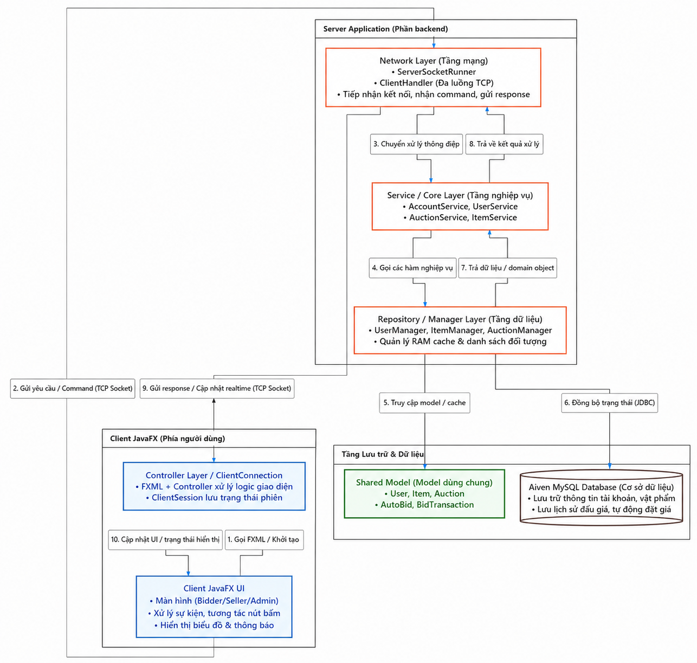

# Hệ thống Đấu giá Trực tuyến

Dự án xây dựng một hệ thống đấu giá trực tuyến theo mô hình **Client-Server** bằng Java. Người dùng có thể đăng nhập theo vai trò **Bidder**, **Seller** hoặc **Admin** để tham gia đặt giá, quản lý sản phẩm, tạo phiên đấu giá, theo dõi cập nhật gần thời gian thực và thanh toán sau khi thắng phiên.

Hệ thống sử dụng **JavaFX** cho giao diện, **TCP Socket** cho giao tiếp giữa Client và Server, **MySQL trên Aiven Cloud** để lưu trữ dữ liệu, và **Maven/GitHub Actions** để build, test và đóng gói project.

---

## 1. Mô tả bài toán và phạm vi hệ thống

### 1.1. Bài toán

Đấu giá trực tuyến là bài toán có trạng thái thay đổi liên tục, nhiều người dùng cùng tương tác và nhiều luồng xử lý có thể xảy ra đồng thời. Hệ thống tập trung giải quyết các yêu cầu chính:

- Quản lý người dùng theo vai trò: Bidder, Seller và Admin.
- Cho phép Seller đăng sản phẩm và tạo phiên đấu giá.
- Cho phép Bidder xem phiên đấu giá, đặt giá trực tiếp và cấu hình tự động đấu giá.
- Cập nhật trạng thái phiên đấu giá, giá hiện tại và thông báo cho các Client đang theo dõi.
- Kiểm soát số dư tài khoản khi đặt giá, bị vượt giá và thanh toán.
- Lưu trữ dữ liệu người dùng, sản phẩm, phiên đấu giá, lịch sử bid và cấu hình auto-bid.

### 1.2. Phạm vi hệ thống

Hệ thống gồm ba phần chính:

- **Client JavaFX:** hiển thị giao diện, nhận thao tác người dùng, gửi command tới Server và nhận phản hồi/cập nhật realtime.
- **Server:** tiếp nhận kết nối TCP Socket, xử lý nghiệp vụ, quản lý trạng thái phiên đấu giá, RAM cache và đồng bộ dữ liệu với database.
- **Database:** lưu trữ dữ liệu hệ thống trên MySQL Aiven Cloud thông qua JDBC.

Các nhóm người dùng chính:

- **Bidder:** đăng ký, đăng nhập, nạp tiền, xem phiên đấu giá, đặt giá, cấu hình auto-bid, xem lịch sử và thanh toán phiên đã thắng.
- **Seller:** quản lý sản phẩm, tạo phiên đấu giá, theo dõi phiên do mình tạo và nhận tiền khi người thắng thanh toán.
- **Admin:** quản lý người dùng, sản phẩm và phiên đấu giá.

---

## 2. Công nghệ sử dụng và yêu cầu cài đặt

### 2.1. Công nghệ sử dụng

| Thành phần | Công nghệ |
|---|---|
| Ngôn ngữ chính | Java 17 |
| Giao diện | JavaFX 17.0.2, FXML, CSS |
| Giao tiếp mạng | TCP Socket |
| Cơ sở dữ liệu | MySQL trên Aiven Cloud |
| Truy cập database | JDBC, mysql-connector-j 8.3.0 |
| Kiểm thử | JUnit Jupiter |
| Quản lý project | Apache Maven |
| CI/CD | GitHub Actions |

### 2.2. Yêu cầu cài đặt

Trước khi chạy chương trình, cần cài đặt:

1. **JDK 17 trở lên**

   Kiểm tra bằng lệnh:

   ```bash
   java -version
   javac -version
   ```

2. **Apache Maven 3.6 trở lên**

   Kiểm tra bằng lệnh:

   ```bash
   mvn -version
   ```

3. **Kết nối Internet**

   Server cần kết nối Internet để truy cập MySQL trên Aiven Cloud.

---

## 3. Cấu trúc thư mục

Dự án được tổ chức theo các module chính sau:

```text
HeThongDauGiaTrucTuyen/
├── .github/
│   └── workflows/              # GitHub Actions CI/CD
├── src/
│   ├── client/                 # Module Client JavaFX
│   │   ├── MainFx.java         # Entry point của ứng dụng Client
│   │   ├── controller/         # Controller xử lý sự kiện giao diện
│   │   ├── network/            # Kết nối TCP Socket tới Server
│   │   ├── state/              # Trạng thái Client và cập nhật realtime
│   │   └── view/resources/     # FXML, CSS, hình ảnh và tài nguyên giao diện
│   │
│   ├── server/                 # Module Server
│   │   ├── MainServer.java     # Entry point của Server
│   │   ├── network/            # ServerSocketRunner, ClientHandler, protocol xử lý kết nối
│   │   ├── repository/         # DBConnection, DatabaseManager, User/Item/AuctionManager
│   │   └── service/            # AccountService, AuctionService, ItemService, UserService
│   │
│   ├── shared/                 # Thành phần dùng chung
│   │   ├── exception/          # Exception nghiệp vụ tự định nghĩa
│   │   └── model/              # User, Item, Auction, AutoBid, BidTransaction...
│   │       └── item/factory/   # Factory khởi tạo các loại sản phẩm
│   │
│   └── test/                   # Unit test
│       └── AuctionTest.java
│
├── pom.xml                     # Cấu hình Maven
└── README.md                   # Tài liệu hướng dẫn project
```

---

## 4. Kiến trúc tổng thể

Hệ thống hoạt động theo kiến trúc **Client-Server** với luồng xử lý khép kín (Closed Loop Flow):

<p align="center">
  
</p>

---

## 5. Design pattern và OOP đã áp dụng

- **Encapsulation:** đóng gói dữ liệu trong model/service, thao tác thông qua method.
- **Inheritance & Polymorphism:** `User` được mở rộng thành `Bidder`, `Seller`, `Admin`; `Item` có các loại sản phẩm cụ thể như tranh ảnh, điện tử, xe cộ.
- **Factory Method:** dùng `ItemFactory` để khởi tạo sản phẩm theo loại.
- **State Machine:** quản lý vòng đời phiên đấu giá qua các trạng thái như `OPEN`, `RUNNING`, `FINISH`, `PAID`, `CANCELED`.
- **Observer / Realtime update:** Server lưu danh sách Client đang theo dõi phiên và gửi cập nhật khi giá/trạng thái thay đổi.
- **Singleton:** dùng cho một số lớp quản lý kết nối, trạng thái và dữ liệu dùng chung.

---

## 6. Hướng dẫn chạy chương trình

Các lệnh dưới đây có thể chạy trên Windows, Linux và macOS nếu đã cài JDK và Maven.

### 6.1. Biên dịch và đóng gói

Tại thư mục gốc của project, chạy:

```bash
mvn clean package
```

Sau khi build thành công, file JAR được tạo tại:

```text
target/HeThongDauGia-1.0-SNAPSHOT-jar-with-dependencies.jar
```

### 6.2. Chạy Server

Cần chạy Server trước Client.

Cách 1: chạy bằng Maven:

```bash
mvn exec:java -Dexec.mainClass="server.MainServer"
```

Cách 2: chạy bằng file JAR đã build:

```bash
java -cp target/HeThongDauGia-1.0-SNAPSHOT-jar-with-dependencies.jar server.MainServer
```

Khi Server khởi động thành công, console sẽ hiển thị thông tin nạp dữ liệu người dùng, sản phẩm và phiên đấu giá từ database.

### 6.3. Chạy Client

Mở một terminal khác, sau đó chạy Client.

Cách 1: chạy bằng Maven:

```bash
mvn exec:java -Dexec.mainClass="client.MainFx"
```

Cách 2: chạy bằng file JAR:

```bash
java -cp target/HeThongDauGia-1.0-SNAPSHOT-jar-with-dependencies.jar client.MainFx
```

Nếu file JAR đang cấu hình `Main-Class` là `client.MainFx`, có thể chạy bằng:

```bash
java -jar target/HeThongDauGia-1.0-SNAPSHOT-jar-with-dependencies.jar
```

> Lưu ý: với một số môi trường chưa có JavaFX runtime phù hợp, nên chạy bằng Maven hoặc IntelliJ IDEA để Maven tự quản lý dependencies.

---

## 7. Chạy bằng IntelliJ IDEA

1. Mở project bằng IntelliJ IDEA.
2. Chờ Maven tải toàn bộ dependencies.
3. Chạy `server.MainServer` trước.
4. Sau khi Server khởi động thành công, chạy `client.MainFx`.
5. Nếu chạy nhiều máy, chỉnh địa chỉ kết nối trong `src/client/MainFx.java` thành IP của máy chạy Server hoặc IP Tailscale tương ứng.

---

## 8. Cấu hình kết nối Client-Server

Trong `src/client/MainFx.java`, Client kết nối tới Server qua lệnh:

```java
ClientConnection.getInstance().connect("localhost", 3636);
```

Nếu chạy Server và Client trên cùng một máy, giữ nguyên:

```java
ClientConnection.getInstance().connect("localhost", 3636);
```

Nếu chạy nhiều máy qua Tailscale hoặc mạng nội bộ, thay `localhost` bằng địa chỉ IP của máy chạy Server:

```java
ClientConnection.getInstance().connect("<IP_may_chay_server>", 3636);
```

Ví dụ:

```java
ClientConnection.getInstance().connect("100.x.x.x", 3636);
```

Sau khi thay đổi địa chỉ kết nối, build lại project:

```bash
mvn clean package
```

---

## 9. Chức năng đã hoàn thành

### 9.1. Lõi hệ thống

- Giao tiếp Client-Server bằng TCP Socket.
- Xử lý nhiều kết nối Client ở phía Server bằng `ClientHandler`/thread.
- Quản lý RAM cache cho user, item và auction.
- Đồng bộ dữ liệu với MySQL Aiven Cloud thông qua JDBC.
- Theo dõi Client đang xem phiên đấu giá để gửi realtime update.
- Khôi phục dữ liệu từ database khi Server khởi động.
- Unit test cho một số luồng nghiệp vụ chính.
- CI/CD bằng GitHub Actions để build/package và tạo release artifact.

### 9.2. Bidder

- Đăng ký và đăng nhập tài khoản.
- Nạp tiền vào ví cá nhân.
- Xem danh sách phiên đấu giá đang mở/đang chạy.
- Xem chi tiết phiên đấu giá.
- Đặt giá trực tiếp theo bước giá hợp lệ.
- Cấu hình auto-bid với mức giá tối đa.
- Nhận thông báo realtime khi có thay đổi liên quan đến phiên đấu giá.
- Xem lịch sử/diễn biến giá.
- Xem các phiên đã thắng và thanh toán bằng số dư tài khoản.

### 9.3. Seller

- Thêm sản phẩm mới.
- Chọn danh mục sản phẩm: tranh ảnh, điện tử, xe cộ.
- Cập nhật hoặc xóa sản phẩm chưa đưa vào đấu giá.
- Tạo phiên đấu giá cho sản phẩm hợp lệ.
- Xem danh sách và trạng thái các phiên đấu giá do mình tạo.
- Nhận tiền sau khi người thắng thanh toán phiên đấu giá.

### 9.4. Admin

- Đăng nhập bằng tài khoản quản trị viên.
- Xem và xóa tài khoản người dùng.
- Xem và xóa sản phẩm.
- Tạo tài khoản mới từ giao diện Admin.
- Hủy phiên đấu giá khi cần.
- Khôi phục phiên đấu giá đã hủy về trạng thái chờ đấu giá và đặt lại thời gian.

### 9.5. Chức năng tùy chọn

- Auto-bidding.
- Anti-sniping.
- Bid history visualization.

---

## 10. CI/CD

Project sử dụng GitHub Actions để tự động build và đóng gói khi có cập nhật trên nhánh cấu hình trong workflow.

Workflow chính thực hiện:

1. Checkout source code.
2. Cài đặt Java 17.
3. Chạy Maven package.
4. Tạo GitHub Release và upload file `*-with-dependencies.jar`.

---

## 11. Báo cáo và video demo

- **Báo cáo PDF:** Link: https://drive.google.com/file/d/17t-fFiBuf3rAAvi1BiXpld-rNE3GeZn5/view?usp=sharing
- **Video demo:** Link: https://drive.google.com/file/d/1NydRQMnGJ2bVtFW1dEHD-Tr7Rax67jP2/view?usp=sharing

---

